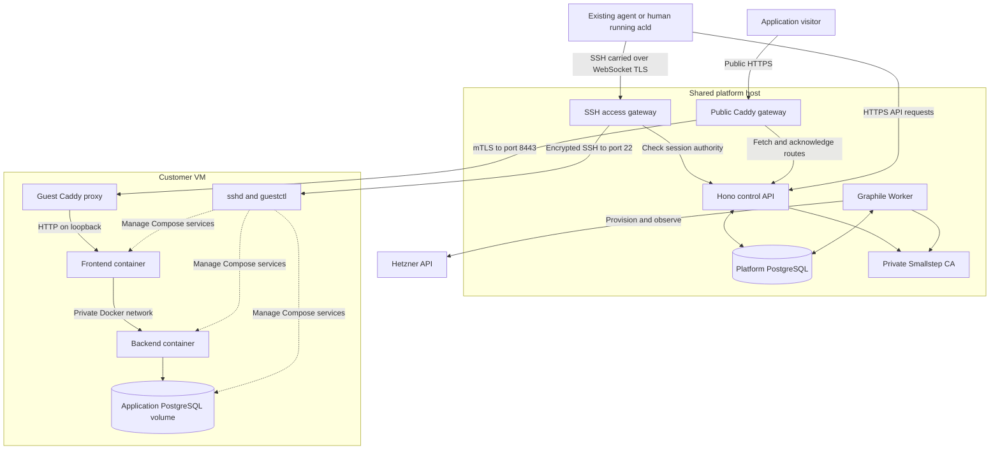

# Architecture and examples

Agent-cloud is an open-source cloud that customers operate through existing agents. The product provisions ordinary Hetzner VMs and supplies authenticated access, durable operations, Compose deployment, HTTPS routing and recovery tools. The customer brings the agent and application code.

An operator runs a shared platform host containing the API, worker, platform PostgreSQL, private certificate authority and two gateways. Each customer machine is a separate VM; its frontend, backend and application PostgreSQL can run together in Docker Compose. **The platform database and the customer's application database are separate databases on separate machines.** Multiple applications may share an owned customer VM, subject to its capacity.

Use the [customer walkthrough](../customer-quickstart.md) to deploy, the [operator guide](../self-host-customer.md) to run the platform, and the [full-stack example](../../examples/full-stack/README.md) for a complete application. Current verification and availability live in [CONTEXT.md](../CONTEXT.md).

Command examples use `<...>` placeholders for current IDs, hostnames and private paths. Generate and save a fresh UUID for each new intent, for example with `node -e "console.log(require('node:crypto').randomUUID())"`; retain it for retries. Operator `pnpm` examples use the pinned workspace version through `npm exec --yes --package=pnpm@12.3.4 -- pnpm <command>`. Customer commands use the installed `acld` release.



## Components and source map

The stack uses Node.js 24, TypeScript, pnpm workspaces, Hono, Zod, PostgreSQL 17, Drizzle and Graphile Worker. Guest execution uses native OpenSSH, systemd and Docker Compose. Caddy handles HTTP; Smallstep issues SSH and internal TLS identities.

| Component                     | Source                                                                                                        | Responsibility                                                           |
| ----------------------------- | ------------------------------------------------------------------------------------------------------------- | ------------------------------------------------------------------------ |
| API and admission             | [apps/control/src/app.ts](../../apps/control/src/app.ts), [lifecycle.ts](../../apps/control/src/lifecycle.ts) | Validate requests, authenticate, authorize and admit operations          |
| Background work               | [worker.ts](../../apps/control/src/worker.ts), [tasks.ts](../../apps/control/src/tasks.ts)                    | Execute durable jobs and reconcile unfinished work                       |
| Customer CLI                  | [apps/cli/src](../../apps/cli/src)                                                                            | Commander commands, private credentials and guest workflows              |
| SDK and contracts             | [packages/sdk](../../packages/sdk), [packages/contracts](../../packages/contracts)                            | Typed HTTP client, shared Zod schemas and branded IDs                    |
| Database                      | [packages/db](../../packages/db)                                                                              | Schema, immutable migrations, SQL guards and advisory locks              |
| Provider                      | [packages/hetzner](../../packages/hetzner)                                                                    | Catalog, inventory and narrowly defined provider actions                 |
| Certificates and operator SSH | [packages/pki](../../packages/pki), [packages/remote](../../packages/remote)                                  | Certificate issuance/validation and restricted native SSH helpers        |
| Customer access gateway       | [apps/access-gateway](../../apps/access-gateway)                                                              | Forward SSH through authorized WebSocket sessions                        |
| Public gateway                | [apps/public-gateway](../../apps/public-gateway)                                                              | Public HTTPS and allocation-authenticated upstream routing               |
| Guest runtime                 | [packages/guestctl](../../packages/guestctl), [build-guest.ts](../../scripts/build-guest.ts)                  | Enrollment, inspection, renewal, Compose, commands and backup helpers    |
| Images                        | [packages/images](../../packages/images), [image-builds.ts](../../apps/control/src/image-builds.ts)           | Immutable inputs, builder/verifier workflow and signed releases          |
| Protected storage             | [packages/backup-store](../../packages/backup-store), [backups.ts](../../apps/control/src/backups.ts)         | Encrypted capture, exact object versions, retention and isolated restore |
| Recipes and instructions      | [packages/recipes](../../packages/recipes), [customer skill](../../skills/agent-cloud/SKILL.md)               | Ordinary Compose templates and instructions for existing agents          |
| Deployment and application    | [customer.yaml](../../infra/compose/customer.yaml), [examples/full-stack](../../examples/full-stack)          | Platform containers and the tested customer application                  |

The platform template runs six persistent services. The public and access gateways are separate containers sharing the API container's network namespace. Public ports are 80/443; the Hono API and access listener use loopback ports 4319 and 4322. Platform PostgreSQL and the CA have no host ports. Operator and retention commands are separate one-shot roles.

## State and ownership

Platform PostgreSQL holds accounts, projects, grants, machine operations, provider ownership, images, access sessions, routes and backup receipts. Graphile uses the same PostgreSQL installation, allowing operation admission and job insertion in one transaction.

| Concept             | Meaning                                                                                  |
| ------------------- | ---------------------------------------------------------------------------------------- |
| Account / project   | Customer ownership and a scope for permissions                                           |
| Grant               | A credential's capabilities, project selection, limits, expiry and parent                |
| Machine             | Customer-visible machine ID and version                                                  |
| Allocation          | Provider VM/IP reservation, admitted offer and retirement state                          |
| Operation / attempt | Requested work, followed by each durable external action and its observed outcome        |
| Owned resource      | Exact provider ID, allocation and ownership labels                                       |
| Image pin           | The signed retained snapshot selected for an allocation                                  |
| Compose release     | A guest-local application version, source digest, runtime configuration and image IDs    |
| Route               | Account-owned hostname with desired and acknowledged versions                            |
| Backup / restore    | Capture scope, protected object receipt, reserved bytes and replacement-machine progress |

Guest application state lives elsewhere: Compose records under `/var/lib/agent-cloud/compose/<app>`, command records under `/var/lib/agent-cloud/runs/<uuid>`, and database data in Docker named volumes. Caddy configuration/certificates and platform private identity also need durable storage. Guest records are customer diagnostics; root on that VM can modify them, so they are not authoritative billing records.

## Sign-in, delegation and trust

The operator admits a GitHub numeric user ID with a bounded policy using `pnpm customer admit <private-request.json>` or the packaged operator command. Admission creates an account, default project and an unexposed parent grant. The customer then runs:

```sh
acld login --server <operator-HTTPS-origin>
acld whoami
acld capabilities
acld agent instructions
acld agent install --directory <existing-agent-skill-parent>/agent-cloud
```

GitHub approval happens in the browser. The API verifies the GitHub token against its configured OAuth application and admitted identity. The CLI retains a private cloud token; the platform stores its hash. Every customer request checks current grant ancestry, including parent expiry/revocation, using database time. A child grant cannot exceed its parent's authority or expiry.

For a restricted agent, prepare an explicit policy file as described in the [delegation instructions](../../skills/agent-cloud/SKILL.md#delegate-access):

```sh
acld grant create inspector --policy ./read-only-policy.json \
  --expires-at <expiry-within-parent-lifetime> \
  --credentials <new-private-credential-file>
ACLD_CREDENTIALS=<that-file> acld whoami
acld grant revoke <returned-grant-id>
```

`machine:exec` grants root-equivalent VM access: `agent-customer` has passwordless sudo. Compose and durable commands use this channel. `deploy:write` does not restrict a credential that can already execute arbitrary root commands. Revocation closes managed sessions and prevents further authorized access; it cannot undo code already run, remove alternate access installed by root, or automatically cancel an admitted durable command. Cancellation is explicit.

Provider credentials remain in the trusted platform. Customer VMs receive their own enrollment material and leaf identities. Gateways have their own limited service credentials, not provider tokens, database access or CA signing keys. The offline root private key stays outside the platform host. See [customer authentication](customer-authentication.md) and [customer SSH](customer-ssh.md).

## What happens when a machine is created

```sh
acld project create demo
acld catalog
acld usage
acld machine create demo --project <project-id> \
  --size small --region <allowed-region> --key <saved-request-key>
acld operation wait <operation-id>
acld machine inspect <machine-id>
```

The create request reaches `POST /v1/projects/:projectId/machines`. The API validates its body and idempotency key, locks admission/account state, reloads authority, checks project ownership, name, size, region and quoted limits, then saves the machine, allocation, operation, image pin, reservation, audit event and job together. It returns an operation before the VM is ready.

The worker serializes advancement per machine. It creates an owned Primary IP and submits the server create with the selected snapshot, firewall and cloud-init bootstrap. Before each external mutation, the effect journal commits its intent. A timeout leaves an uncertain outcome to reconcile against actions, exact IDs and ownership labels. The worker never creates another paid VM merely because a response was lost. An empty eventually consistent listing is not sufficient evidence that an uncertain create never happened.

The new VM generates its identity keys and enrolls using a one-time bootstrap bound to its account, machine, allocation and image. The platform verifies provider ownership and a pinned-key SSH proof before issuing certificates. A fresh runtime probe must confirm identity, manifest, component health, proxy and disk space before creation succeeds. Reboot checks also require a new boot ID.

Save request keys before submitting them. Reuse the same key and unchanged body after an uncertain response. Lifecycle changes require the observed machine version; stale changes fail instead of overwriting newer intent. The [provider journal](provider-resources.md) and [guest bootstrap](guest-bootstrap.md) guides cover the detailed checks.

## Deploy and update the full-stack example

The [example source](../../examples/full-stack/README.md) contains a static frontend served by Caddy, a TypeScript backend with a visit-counter API, and PostgreSQL 17. PostgreSQL has a private network and named volume. Only the frontend publishes a loopback port.

Reserve a generated hostname, then prepare a new private context from the example directory:

```sh
acld route publish <machine-id> --name demo --port 3000 --key <route-uuid>
acld route wait <returned-hostname>
node prepare.mjs <returned-hostname> <new-private-context-directory>
acld compose apply <machine-id> demo --source <context-directory> \
  --file compose.yaml --release <release-uuid>
acld compose wait <machine-id> demo
acld compose inspect <machine-id> demo
acld compose logs <machine-id> demo --service backend
```

`prepare.mjs` copies a fixed application file set and generates a private database password. It refuses existing output so retries cannot silently replace credentials. Docker builds happen on the customer VM; local backend dependency installation is unnecessary.

The Compose CLI walks the context, rejects links/special files, and reads at most 8 MiB across 1,024 regular files. It includes every regular file, without implicit ignore rules. It base64-encodes the bundle into JSON and sends it over SSH stdin to `sudo guestctl compose --json`. **Compose apply itself does not use SFTP.** General `file put/get` does. There are no dedicated REST equivalents for Compose/run execution; HTTP handles access admission and the CLI invokes the guest helpers.

Guestctl persists the request and release ID, then starts supervised work. It builds/pulls images, records their local image IDs, saves normalized runtime configuration, and runs `docker compose up --detach --wait` with a stable `acld-<app>` project, builds disabled and pulls disabled for that final apply. The containers and supervised work continue after the CLI exits.

Open the returned HTTPS hostname and record a visit. To update the example, edit the existing context's backend/frontend revision while preserving its password and volume names:

```sh
acld compose apply <machine-id> demo --source <same-context-directory> \
  --file compose.yaml --release <new-release-uuid> --expected-release <current-release-uuid>
acld compose wait <machine-id> demo
```

After a failed release, recover an earlier successful one:

```sh
acld compose recover <machine-id> demo --from <successful-release-uuid> \
  --release <new-recovery-uuid> --expected-release <failed-release-uuid>
acld compose wait <machine-id> demo
```

Recovery reuses retained configuration and image IDs as a new release and preserves named volumes. It does not undo database migrations, provide an off-machine backup, or guarantee zero downtime. Configure real service health checks and verify application behavior; a container merely running is not proof of correctness. See [Compose internals](compose-deployment.md).

## SSH, files and commands after disconnect

The CLI creates an ephemeral Ed25519 key and random transport ticket. It sends the public key and ticket hash to the access-session API. After current authority and allocation checks, it receives a short-lived source-restricted SSH certificate. Native SSH uses a ProxyCommand carrying SSH bytes over WebSocket TLS to `/v1/ssh`; the access gateway forwards them to guest port 22 and checks ongoing authority through private API calls.

```sh
acld ssh <machine-id> -- id -u
acld file put <machine-id> ./application.txt /var/lib/agent-customer/application.txt
acld file get <machine-id> /var/lib/agent-customer/application.txt ./downloaded.txt
```

For detached work, save a private `run.json`:

```json
{
  "argv": ["/usr/bin/sleep", "20"],
  "cwd": "/var/lib/agent-customer",
  "env": {},
  "timeoutSeconds": 60,
  "maximumOutputBytes": 4096
}
```

```sh
chmod 0600 run.json
acld run submit <machine-id> --id <saved-run-uuid> --request ./run.json
acld run inspect <machine-id> <saved-run-uuid>
acld run logs <machine-id> <saved-run-uuid> --after 0
acld run cancel <machine-id> <saved-run-uuid>
```

Each invocation has a systemd unit and persisted request/start/result/output records. A started receipt prevents the same invocation from executing again after a lost response. A crash or reboot can produce an explicit interruption; the system does not guess whether a migration ran. These records do not provide exactly-once execution after disk loss or rollback. See [durable commands](durable-commands.md).

## Public traffic and domains

Browser HTTPS terminates at the platform's public Caddy gateway. It forwards over mutually authenticated TLS to the guest's port 8443, where guest Caddy forwards to `127.0.0.1:<application-port>`. Frontend/backend/database traffic then stays within the application's Docker networks.

The platform stores desired route versions. A worker applies the guest binding first; the public gateway fetches and acknowledges authenticated route snapshots. Hostname and route-version checks keep the two ends consistent. The public gateway overwrites the internal route-version header; the guest removes it before forwarding to the app. `route wait` proves the proxy configuration was applied, not that the application is healthy.

Custom hostnames require a TXT challenge and matching gateway A/AAAA records:

```sh
acld domain add app.example.com
# Set the returned TXT challenge and point A/AAAA records at the gateway.
acld domain verify <challenge-uuid>
acld route publish <machine-id> --hostname app.example.com \
  --challenge <challenge-uuid> --port 3000 --key <saved-route-uuid>
```

Keep application hostnames separate from the trusted account/login domain. Caddy retains configuration and certificates, so an API-only outage need not remove existing routes. A whole platform/gateway outage interrupts public ingress while customer containers keep running. The current shared gateway is a single failure and bandwidth bottleneck; this deployment is not highly available. See [HTTPS routing](https-routing.md).

## Database and analytics recipes

Recipes generate ordinary private Compose directories offline. They pin images, generate credentials once and retain a release ID. Separate Compose applications do not automatically share a network or database.

```sh
acld recipe list
acld recipe prepare postgres --version 1.0.0 --output <new-postgres-context>
acld recipe prepare umami --version 1.0.0 --output <new-umami-context> --port 3001
acld compose apply <machine-id> umami --source <umami-context> \
  --release <saved-context-release-uuid> --wait-seconds 300
acld compose wait <machine-id> umami
acld route publish <machine-id> --name analytics --port 3001 --key <route-uuid>
```

Umami also needs a registered website, its tracking script in the customer's HTML, and a verified pageview/event. Installation alone does not instrument an application. Its generated administrator credentials must remain private. See [recipes and instrumentation](../recipes.md).

## Protected backups and isolated restore

Application backups are distinct from Hetzner automated VM backups, which disappear with their source VM. The protected path captures the exact successful Compose release, a PostgreSQL 17 dump and globals, retained source/configuration, and explicitly declared files. The database dump is consistent; file capture is best effort relative to it.

The control worker encrypts the archive with a per-backup AES-256-GCM data key and a separate versioned wrapping key. It writes ciphertext to versioned, retention-protected S3 storage using separated writer/reader/deleter identities. Upload intent precedes PUT; ambiguous results are resolved by exact-version inspection. Independent copies of the keyring and control database are required to recover the data.

```sh
acld backup capture <machine-id> demo --id <backup-uuid> \
  --release <successful-release-uuid> --service database --database reference --user reference
acld backup wait <backup-uuid>
acld backup restore <backup-uuid> recovered --id <restore-uuid> \
  --name recovered --size small --region <allowed-region>
acld backup restore-wait <restore-uuid>
```

Restore creates another budget-checked VM and imports into an isolated Compose project. Customer SSH and routing remain disabled until restore verification succeeds; restored services initially have no public ports. Inspect the application, fence source writes, then promote and move the retained route:

```sh
acld compose promote <restored-machine-id> recovered \
  --release <promotion-uuid> --expected-release <returned-restored-release-id>
acld route move <existing-hostname> <restored-machine-id> \
  --port 3000 --expected-version <route-version> --key <route-move-uuid>
```

Verify a new application write after cutover. Daily schedules and exact-version retention/purge use the same durable ownership model. Protected Hetzner storage and source-loss restoration still need provider verification; the existing connected recovery proof uses local storage/native VMs. See [protected backups](protected-backups.md).

## Guest images and platform recovery

The operator image factory runs separately from customer admission. For each guest image version it verifies immutable installation inputs, creates a temporary builder, installs and sanitizes it, takes a snapshot, boots an independent verifier, checks identity/runtime, removes temporary resources and signs the retained release evidence. Normal customer creates reuse that snapshot; they do not each build a guest image.

An allocation pins a retained signed release before creation. The worker also checks current provider ownership and trust; a signature alone cannot establish that a snapshot still exists. Guest identities and certificate renewal are bound to the particular allocation. See [image releases](image-release.md), [sanitation](image-sanitation.md), [runtime readiness](guest-runtime.md) and [renewal](guest-renewal.md).

Platform recovery needs more than restoring PostgreSQL bytes. A checkpoint may predate a revoked grant or a submitted create. An external generation file and database lease keep restored mutators fenced. The operator stops old processes, revokes their external mutation credentials, restores matching private material, revokes restored customer authority and reconciles outstanding effects before resuming. External credential revocation and post-checkpoint effects require operator evidence; this is not automatic failover. See [control recovery](../control-recovery.md).

## Costs, cleanup and verified boundaries

`acld usage` reports reservations, not invoices. Admission checks explicit currency, machine count and hourly limits at account, grant and platform levels. Offers include VM/IP pricing and the automated-backup surcharge. Prices are refreshed before fresh spending; unknown outcomes retain reservations. Power-off remains billable. Traffic, shared platform costs, storage and total lifetime spend need separate operating limits. Resizing is explicit, requires power-off and cannot shrink disk or change architecture.

After authorizing deletion and application data loss:

```sh
acld route inspect <hostname>
acld route remove <hostname> --expected-version <route-version> --key <remove-route-uuid>
acld machine inspect <machine-id>
acld machine destroy <machine-id> --expected-version <machine-version> \
  --allow-data-loss --key <saved-destroy-key>
acld operation wait <destroy-operation-id>
acld machine inspect <machine-id>
acld usage
```

Once deletion is admitted, cleanup can finish even if the caller's credential expires or is revoked. It acts only on exact owned resources, and releases the reservation after confirmed VM/IP absence. This prevents authorization changes from orphaning billable infrastructure. Protected backup objects have their own retention and cleanup lifecycle. See [usage](usage.md) and [machine cleanup](machine-cleanup.md).

The [2026-09-08 live run](../customer-deployment-verification.json) verified real GitHub login, the released CLI, hosted Hetzner provisioning, the ordinary full-stack application over trusted HTTPS, persistence across disconnect/update/failed-build recovery/reboots, restricted access, revocation, logout and exact cleanup. Automated VM backups were enabled. All disposable resources were deleted; no persistent public endpoint remains.

Remaining live evidence includes custom customer DNS, public Umami instrumentation, durable-command interruption/revocation, protected source-loss restore and full control recovery. A fresh independent-agent usability run and complete public operator setup/upgrade procedure also remain. The product uses ordinary VMs and explicit operations; there is no serverless scheduler, automatic scale-to-zero or payment service.
