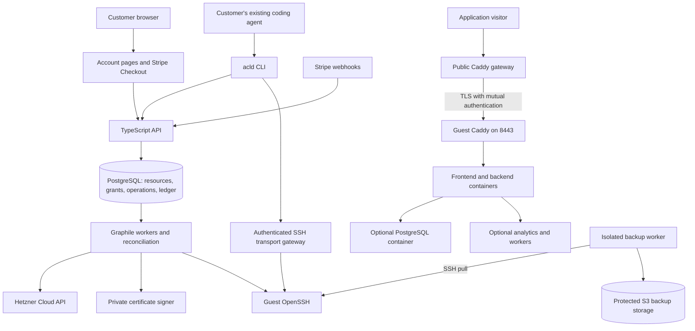

# Agent cloud: research and implementation plan

Research date: 6 September 2026. Status: proposed implementation plan, ready to turn into engineering work. `agent-cloud` and `acld` are working names, not a branding decision. Commands and API examples describe the product to build; they do not exist yet.

Current execution scope, updated 6 September 2026: use the existing GitHub access and set up Hetzner directly where possible. Stripe setup and payment integration are deferred until there is a working product. The billing design below remains a later-stage plan, not a prerequisite for building or testing the machine lifecycle.

Navigation: [decisions](#1-the-decision) · [competitors](#3-competitive-research) · [Hetzner and costs](#5-hetzner-supply-constraints-and-economics) · [architecture](#6-system-architecture) · [stack](#7-stack-and-engineering-conventions) · [CLI/API](#8-cli-api-sdk-and-skills) · [access](#9-identity-and-delegated-authority) · [recovery](#14-backups-restoration-and-durability) · [billing](#15-billing-spending-authority-and-suspension) · [file structure](#17-repository-and-file-structure) · [bottlenecks](#19-bottlenecks-and-failure-register) · [milestones](#23-implementation-sequence).

## 1. The decision

Build an open-source hosting service that customers operate through their existing coding agents. A customer connects a payment method, authorizes the CLI, and gives their agent permission to create and operate ordinary Linux machines. The application keeps running after the agent finishes.

Use Hetzner Cloud for the machines. Start with one x86 VM per application or trusted group of services, an always-on lifecycle, Docker Compose, SSH, HTTPS hosting, and recoverable service recipes. Customers choose their machine size. Neither a Hetzner benchmark nor a study of customers' memory requirements is a prerequisite.

The product owns the parts that should remain reliable when an agent disconnects or makes a mistake: resource allocation, access, spending limits, public routes, retained backups, operation history, and recovery. The customer and their agent own the application and can administer its VM.

The core commercial proposition is: **an ordinary server that an agent can put into production, operate, recover, and hand back to its owner without a cloud console.**

This category already exists. ASCII Box and exe.dev are particularly close competitors. A CLI, skills, inexpensive Hetzner machines, and a small website are a useful starting point, but they are not sufficient differentiation. The opportunity is to execute well on long-lived small applications: clear operating boundaries, predictable costs, tested recovery, transparent software, and a short path from source code to a working domain.

### Decisions to carry into implementation

| Area | Decision |
| --- | --- |
| Customer | A person or team using an existing coding agent |
| Agent | Supplied by the customer; no model calls, agent loop, chat product, or hosted coding agent |
| Infrastructure | Hetzner Cloud, initially one EU location |
| Isolation | One customer trust boundary per VM; no unrelated customers sharing a Docker host |
| Runtime | Ubuntu 24.04 LTS, Docker Engine and Compose v2, OpenSSH, systemd |
| Product code | TypeScript on Node.js 24 LTS |
| Management | Versioned HTTP API, CLI, generated TypeScript SDK, published skills |
| Web | Small account, payment, authorization, and access-revocation pages |
| Guest management | SSH plus a small deterministic `guestctl` executable; no permanent custom management daemon |
| Hosting | Shared public Caddy gateway, encrypted connection to a Caddy proxy in each guest |
| State | PostgreSQL and Graphile Worker; no Redis or Kubernetes initially |
| Production lifecycle | Always on; explicit reboot, power off, resize, restore, and destroy |
| Database | PostgreSQL recipe on the customer's VM; optional, separately backed up |
| Analytics | Optional Umami recipe on the customer's VM |
| Billing | Prepaid hosting usage, initially EUR and hourly capacity prices |
| License | Apache-2.0 for the platform, CLI, SDK, guest helper, and our recipes |
| First launch | Invite-only paid alpha with explicit single-machine and shared-infrastructure limitations |

## 2. Scope and assumptions

The first customer workload is a modest web application: a frontend, backend, PostgreSQL database, perhaps analytics and a background worker. All can run on one machine. The frontend may be static files or a server-rendered application. WebSockets, cron jobs, and long-running processes should work normally.

One VM can hold several services belonging to the same trusted owner. Several mutually untrusted end customers should get separate VMs, even if one agency pays for them. Root access is the boundary: Docker containers inside a customer's VM are an organizational tool, not isolation from that customer.

Start with Linux/macOS CLI support and Windows through WSL. Keep the protocol compatible with a later native Windows CLI. Initial deployment is in Nuremberg, subject to actual inventory; additional EU locations are explicit catalog choices rather than an undisclosed fallback across jurisdictions.

These are design choices, not claims that every application fits this model. Applications requiring high availability, very large databases, specialized hardware, arbitrary public TCP/UDP services, or autoscaling replicas need additional infrastructure. The CLI should say so through capability descriptions rather than forcing them into a misleading abstraction.

### What the user experiences

1. Sign in on the website and buy hosting credit through Stripe Checkout.
2. Run `acld login`. Approve the device code in the browser.
3. Create a project and a scoped delegation for the coding agent. Set permitted sizes, region, maximum active machines, and spending authority.
4. Install the published skill for the chosen agent, or give it the CLI documentation URL.
5. Ask the agent to deploy an application. It chooses a size, creates a VM, transfers code or pulls an image, starts Compose, checks health, and publishes HTTPS.
6. Later, ask the same or another agent to diagnose a failure, add analytics, update the app, increase capacity, or restore a backup.
7. Manage payment and revoke access through the small account page. Operational features remain available through the CLI.

An agent can perform approved work without asking the owner to approve each command. An owner can also give a narrower grant that permits deployment to an existing machine but cannot create machines or spend more money.

## 3. Competitive research

The comparisons below concern technical and product overlap. They are not market-share rankings. Public documentation establishes behavior; public files establish only the implementation visible in those files. No private control plane was inspected, no paid competitor environments were created, and no provisioning latency was independently measured.

### 3.1 Box by ASCII: the closest overlap

The reference to “ascii box” resolves to [Box by ASCII](https://box.ascii.dev/). Its published product combines persistent Ubuntu machines, SSH, Docker, public hosting, CLI/API access, and snapshots. Its [API](https://docs.ascii.dev/box/api/v1) exposes asynchronous operations and idempotency keys, both essential patterns for clients that may disconnect or retry.

ASCII explicitly states that a Box currently runs on a Hetzner VPS. Its [snapshot documentation](https://docs.ascii.dev/box/snapshots) describes incremental filesystem capture, restoration onto fresh hardware, and fetching files as they are needed. It excludes some transient state, including Docker build cache. These are documented implementation details; the underlying storage service's source and operational performance were not verified.

Its [billing documentation](https://docs.ascii.dev/box/billing) lists a $20/month entry plan with pooled machine time. Published running rates include $0.018/hour for a small Box and $0.036/hour for the default size. Stopped Boxes are not billed for compute. Its [FAQ](https://docs.ascii.dev/box/faq) distinguishes a creation/resume TTL from an activity-based idle timer. That distinction matters for unattended applications.

The public TypeScript SDK's [package metadata](https://registry.npmjs.org/@asciidev%2Fbox-sdk/latest), version 0.0.34 at inspection, identifies it as an MIT-licensed OpenAPI-generated client. This supports generating our client from a canonical API contract. It does not establish that ASCII's entire platform is open source.

What to learn:

- Stable resource IDs can survive replacement of the underlying VM.
- Creation, restoration, command execution, and deletion need observable operation records.
- A filesystem restoration system is substantial infrastructure, not a side effect of a cheap VPS API.
- Templates, configuration, and credentials need separate treatment.
- Lifecycle names must describe what happens to processes, data, access, and billing.

Our initial choice is deliberately narrower: no transparent sleep/resume, lazy filesystem, or VM forking. Concentrate on applications that remain online, with durable backups and understandable maintenance. ASCII can also host applications; do not position it as incapable of production hosting.

### 3.2 exe.dev: simple machine access and integrated hosting

[exe.dev](https://exe.dev/docs/what-is-exe) offers persistent machines and an SSH-centered interface. Its [proxy documentation](https://exe.dev/docs/proxy) describes integrated HTTPS and access control. Its [integration documentation](https://exe.dev/docs/integrations) shows another useful boundary: selected credentials can be handled outside the guest.

Public source inspected:

- [The published skill](https://github.com/boldsoftware/exe.dev/blob/91baf512881344a980f4547cc33289debd72f019/skill/SKILL.md) teaches a short command set and points to progressively discoverable documentation.
- [The SSH helper](https://github.com/boldsoftware/exe.dev/blob/91baf512881344a980f4547cc33289debd72f019/exe-ssh/src/exe_ssh/cli.py) uses ordinary SSH configuration and subprocesses around its connection transport.
- [The exeuntu Dockerfile](https://github.com/boldsoftware/exeuntu/blob/8fec772cce3c054850e10e1a818d49956e1eef98/Dockerfile) installs Ubuntu, systemd, Docker tooling, and development tools. This is evidence about the guest image, not the hosted scheduler.

The public [exe.dev repository](https://github.com/boldsoftware/exe.dev) contains helpers and documentation; it should not be described as a verified open-source release of the complete service.

Learn from the familiar SSH interface and small skill. Our image can be smaller because running a browser, editor, or coding agent inside the VM is optional customer software rather than a product requirement.

### 3.3 Sprites: persistent environments with a different storage system

[Sprites' lifecycle documentation](https://docs.sprites.dev/concepts/lifecycle/) describes a local ext4 filesystem backed by NVMe caching and durable object storage. It distinguishes warm suspension from a cold restart. Services restart persistent processes; open connections and in-memory state have different survival rules.

This is relevant architecture, but it is not something to reproduce by powering off a normal Hetzner VM. Recreating it would require a storage and execution platform far beyond the first product. Keep it as a reference if later demand justifies automatic suspension.

### 3.4 Coolify and Dokploy: deployment management already exists

[Coolify](https://github.com/coollabsio/coolify) already manages applications, databases, and services on servers. Its [API routes](https://github.com/coollabsio/coolify/blob/v4.x/routes/api.php) include team- and ability-scoped operations, and its [container-status action](https://github.com/coollabsio/coolify/blob/v4.x/app/Actions/Docker/GetContainersStatus.php) handles health and restart state. Its code is [Apache-2.0 licensed](https://github.com/coollabsio/coolify/blob/v4.x/LICENSE).

[Dokploy](https://github.com/Dokploy/dokploy) is another close reference for deployment and Compose workflows. Its current [license file](https://github.com/Dokploy/dokploy/blob/canary/LICENSE.MD) places ordinary code under Apache-2.0 and reserves `/proprietary` portions under a separate license. Do not assume every directory has the same license.

Both are worth studying before writing deployment mechanics. Neither a CLI nor “full stack on one VPS” is an unoccupied category. Our first release should not become a complete rewrite of their dashboards and integrations. Use standard Compose and a small set of explicit operations; reuse code only after examining the relevant file's license and dependencies.

### 3.5 Other adjacent products

| Product/category | Overlap | Implication |
| --- | --- | --- |
| [Daytona](https://www.daytona.io/docs/en/persistence/) | Programmable environments and persistence | Compare durability and stopped-state behavior, not just environment creation |
| [E2B](https://e2b.dev/docs/sandbox) | Agent-oriented execution environments | Agents already have alternatives for running code; hosting customer apps must be a clear use case |
| [Railway CLI](https://docs.railway.com/guides/cli) | Existing platform deployment from a terminal | Agents can operate conventional platforms, too |
| VPS + Docker Compose + SSH | Almost the entire raw runtime | Our paid value must exceed distributing a shell script |

### Competitive conclusion

The defensible work is operational: proving that a deploy can be retried, access revoked, a failed machine replaced, a database restored, and a bill explained. Open source adds inspectability and a self-hosting path. Familiar tools reduce the amount an agent must learn. These advantages depend on execution; none guarantees a durable competitive advantage by itself.

## 4. What agents change, and what they do not

| Classic platform feature | Decision for this product |
| --- | --- |
| Rich deployment dashboard | Omit initially; machine-readable operations, CLI output, and logs serve the workflow |
| Framework-specific deployment abstraction | Optional recipes; accept ordinary Linux, Dockerfiles, and Compose |
| Drag-and-drop service composition | Omit; the agent edits files |
| Guided configuration wizards | Replace with schemas, defaults, examples, and explicit errors |
| Proprietary runtime functions | Omit; normal persistent processes |
| Large integration marketplace | Start with a few maintained recipes |
| CLI/API versioning | Essential; agents are sensitive to ambiguous and changing interfaces |
| Authorization and revocation | Essential; skills are instructions, not enforcement |
| Billing and capacity control | Essential; an automated client can create expensive resources quickly |
| Backups, recovery, and incident response | Essential; an agent session ending does not end our responsibility |
| Human account recovery | Essential; the owner must retain control if their agent or token is lost |

Agents do need abstractions where they eliminate repeated uncertainty. An operation ID, a price quote, a scoped grant, and a backup manifest are useful contracts. A proprietary replacement for Linux, networking, and Compose is unnecessary.

## 5. Hetzner supply, constraints, and economics

### 5.1 Initial catalog

Expose provider details rather than inventing a resource unit. Start with three x86 choices and make region availability explicit.

| Product size | Hetzner type | Shared vCPU | RAM | Local disk | Provider €/hour | Provider €/month cap |
| --- | --- | ---: | ---: | ---: | ---: | ---: |
| `small` | CX23 | 2 | 4 GB | 40 GB | 0.0088 | 5.49 |
| `medium` | CX33 | 4 | 8 GB | 80 GB | 0.0136 | 8.49 |
| `large` | CX43 | 8 | 16 GB | 160 GB | 0.0256 | 15.99 |

These are published EU prices after the June 2026 adjustment, excluding VAT and IPv4. Specs come from the [cost-optimized catalog](https://www.hetzner.com/cloud/cost-optimized/); prices from the [price adjustment notice](https://docs.hetzner.com/general/infrastructure-and-availability/price-adjustment/). Check the live price API when creating a price-book version. Do not silently turn a CX order into a materially more expensive CPX order.

[Primary IPv4](https://docs.hetzner.com/cloud/servers/primary-ips/overview/) adds €0.50/month at the published cap. Include one per customer VM at launch to support ordinary IPv4 outbound access. An IPv6-only fleet would need a considered IPv4 egress solution; it is not a free drop-in saving.

### 5.2 Provider constraints that affect the design

From the official [Cloud API reference](https://docs.hetzner.cloud/reference/cloud): use `https://api.hetzner.cloud/v1`, wait for asynchronous Actions to complete, inspect rate-limit headers, and respect the default project request allowance of 3,600/hour. Treat that allowance as a shared budget for workers, reconciliation, and operator tooling.

The [server FAQ](https://docs.hetzner.com/cloud/servers/faq/) documents changing inventory, quota increases, and no nested virtualization. It also explains disk restrictions during resizing. Start the commercial account and request sufficient limits early; do not promise unlimited self-service capacity before the account can supply it.

The [billing FAQ](https://docs.hetzner.com/cloud/billing/faq/) states that powered-off servers remain billable until deleted. Automated provider backups add 20% of the server price. Provisioning, failed allocations, idle machines, and retained resources therefore need explicit cost ownership.

The [firewall FAQ](https://docs.hetzner.com/cloud/firewalls/faq/) lists 50 firewalls across projects and rule/connection limits. Use shared fleet firewall profiles and fixed guest ingress ports. A firewall per customer VM would consume this limit quickly. Do not assume creating more projects bypasses an account-wide limit.

### 5.3 Provisioning speed

Create from a prebuilt, sanitized image. Run only per-machine identity, enrollment, configuration, and health checks at first boot. Preinstalling Docker is useful; running `apt upgrade` and downloading every runtime on the first customer request is avoidable.

Expose these timestamps separately: request accepted, provider allocated, SSH available, runtime ready, application healthy, public route ready. An API accepting a request is not a deployed application.

Do not advertise a boot-time number before measuring the actual shipped path. This is product verification, not a provider-selection benchmark. Initially use no warm pool. Add one only if production telemetry shows a material onboarding problem and its cost is justified. Pooled machines must be unused images; never recycle a previous customer's disk without destructive reprovisioning.

### 5.4 Indicative unit economics

The following customer prices are proposals for planning, not published commitments. There is no customer monthly cap in this initial hourly model; show the monthly estimate prominently.

| Size | Proposed €/allocated hour | At 730 hours | Provider server + IPv4 + 20% backup, monthly caps | Remainder before shared costs |
| --- | ---: | ---: | ---: | ---: |
| Small | 0.020 | 14.60 | 7.09 | 7.51 |
| Medium | 0.035 | 25.55 | 10.69 | 14.86 |
| Large | 0.060 | 43.80 | 19.69 | 24.11 |

The last column is not profit. It must cover public gateways, off-VM backups, payment fees, control-plane servers, monitoring, failed provisioning, grace periods, support, fraud, and taxes where applicable. Short-lived machines incur provider rounding, so their economics differ from continuously allocated ones.

Use this formula in the price-book review:

```text
contribution = net hosting revenue
             - provider allocations and IPs
             - native and off-VM backup storage
             - attributable gateway traffic
             - payment processing and refunds
             - shared infrastructure allocation
             - operating loss allowance
```

Define included backup storage and traffic in the catalog. A proposed starting allowance is 20 GB of stored application backup data and 100 GB of public gateway egress per allocated machine per month. Retained versions count toward storage. Display measured usage and alert before exceeding the allowance; do not advertise unlimited resources. Extra usage requires an enabled account policy or operator handling during alpha.

Provider traffic bundled with each VM does not automatically become a pooled allowance for the shared gateway. The gateway's own traffic and connection capacity need separate accounting.

## 6. System architecture

### Alternatives considered

| Approach | Assessment |
| --- | --- |
| Give the customer a Hetzner token and publish a skill | Smallest implementation, but the customer still owns provider setup, billing, access, and recovery; useful self-management alternative, not the proposed hosted product |
| Fork a complete deployment platform | Reuses mature deployment features, but inherits a much larger product model and maintenance surface; inspect reusable mechanics without making the full platform our foundation |
| Build a thin control plane over standard VMs | Chosen: directly owns the customer account, machine lifecycle, access, routing, and recovery while leaving application tooling familiar |
| Build a pooled microVM/serverless cloud | Can support different utilization economics, but adds isolation, scheduling, storage, and fleet operations; defer until demand warrants a separate infrastructure effort |



### Components and responsibilities

| Component | Owns | Must not own |
| --- | --- | --- |
| API/account application | Authentication, authorization, validation, quotes, operation creation | Long-running cloud calls in request handlers |
| Workers | Provisioning, routes, maintenance, reconciliation, metering | Customer source builds inside control-plane processes |
| PostgreSQL | Durable desired state, operations, billing ledger, grants | Guest application databases |
| Access gateway | Authenticated transport to the authorized VM's SSH port | Provider credentials, arbitrary caller-selected network destinations |
| Public gateway | Authorized host-to-machine routing, public TLS, traffic accounting | Database administration or billing authority |
| Guest | Application runtime, customer files, local service configuration | Fleet credentials or backup-retention authority |
| Backup worker | Pulling, encrypting, storing, and validating recovery material | Executing customer restore code on a privileged platform host |
| Certificate signer | Narrowly authorized SSH and TLS certificate issuance | Payment or application logic |

API and workers are separate processes from one codebase, not separate product microservices. Several can share an infrastructure VM initially. Network gateways and backup execution have separate credentials and deployment boundaries because they encounter untrusted traffic or data.

### Core domain objects

- **Account:** owner, payment relationship, and policy defaults.
- **Project:** resource and delegated-access boundary within an account.
- **Machine:** stable customer-facing ID, region, desired size, and lifecycle.
- **Allocation:** one concrete Hetzner server and its associated resources. A machine can have successive allocations after recovery.
- **Operation:** durable record of a requested change and its progress.
- **Grant:** authorized capabilities, project scope, limits, and expiry.
- **Route:** approved hostname and service destination on a machine.
- **Recipe installation:** recorded version and files for an optional supported service.
- **Backup:** immutable manifest describing captured data and recovery status.
- **Usage event and ledger entry:** independently traceable consumption and financial entries.

Separating machines from allocations prevents a restored VM's new provider ID from changing every customer reference. It does not promise live migration or unchanged public IP addresses.

## 7. Stack and engineering conventions

| Layer | Selection | Reason |
| --- | --- | --- |
| Runtime | Node.js 24 LTS | Maintained baseline; ordinary server and CLI deployment |
| Language | TypeScript, strict mode | Shared contracts and a small contributor learning surface |
| Workspace | pnpm workspaces | Monorepo without a separate build-orchestration platform |
| HTTP server | Hono with its Node adapter | Small API and server-rendered account pages in one application |
| Web rendering | `hono/jsx`, ordinary HTML/CSS, minimal browser JavaScript | No large SPA or frontend framework required |
| Validation/contracts | Zod plus OpenAPI generation | One reviewed contract for HTTP, SDK, CLI docs, and skills examples |
| Database | PostgreSQL 17, `pg`, Drizzle migrations/schema | Durable transactions; raw SQL where locking and queues require it |
| Background work | Graphile Worker | PostgreSQL-backed jobs and transactional enqueueing |
| Auth | Better Auth with OAuth provider/device authorization support | Standard CLI authorization instead of custom OAuth cryptography |
| CLI | Commander, generated SDK, native OpenSSH subprocesses | Familiar interface; reuse the SSH implementation |
| Certificates | Smallstep `step-ca` and OpenSSH certificates | Established signing tools; isolate private signing keys |
| HTTP proxy | Caddy on the public gateway and guest | HTTPS, reverse proxying, and reloadable configuration |
| Billing | Stripe Checkout and webhooks | Hosted payment collection, minimal card-handling surface |
| Backup storage | Hetzner S3-compatible Object Storage in another EU location | Cheap initial off-VM storage with explicit credential separation |
| Control DB recovery | pgBackRest with continuous WAL archival | Recover billing and resource state more precisely than nightly dumps |
| Guest application backup | PostgreSQL dumps plus declared files, encrypted by the backup worker | Small, inspectable first recovery system |
| Packaging | OCI images, npm CLI/SDK packages, signed release manifests | Standard open-source distribution |
| Infrastructure definition | OpenTofu for the platform's own servers; image build scripts and cloud-init | Reproducible hosting without managing each customer VM through Terraform state |
| Quality | Vitest, database integration tests, Playwright for account flows | Test actual failure and authorization boundaries |
| Observability | Pino, OpenTelemetry, Prometheus, Grafana | Structured logs, request/operation traces, bounded metrics |

[Node's release schedule](https://github.com/nodejs/Release) and [Hono's Node documentation](https://hono.dev/docs/getting-started/nodejs) support this baseline. Pin exact dependency and image versions during implementation; this document intentionally avoids pretending today's patch versions will remain correct when development starts.

Use discriminated unions for lifecycle and operation outcomes, branded IDs at internal boundaries, schema-inferred transport types, and exhaustive state handling. Validate untrusted data at HTTP, database decoding, provider responses, and guest output boundaries. Avoid parallel handwritten API interfaces and unsafe type assertions.

Use the same service functions from API routes and worker tasks. Do not make workers call the public API to perform internal state transitions.

## 8. CLI, API, SDK, and skills

### 8.1 CLI surface

The essential commands are small enough to learn from `--help` and one skill.

```text
acld login | logout | whoami
acld context list | use | add
acld project create | list | show
acld auth grant | list | revoke
acld catalog list
acld machine create | list | inspect | reboot | power-off | power-on
acld machine resize | destroy
acld ssh <machine>
acld copy <source> <machine>:<path>
acld run submit | inspect | logs | cancel
acld recipe list | inspect | install | status
acld deploy apply | status | rollback
acld route publish | list | remove
acld domain add | verify | remove
acld backup create | list | inspect | restore | export
acld usage show
acld billing balance | top-up
acld operation inspect | wait | list
acld doctor
acld docs <topic>
```

Every relevant command supports `--json`. Progress and diagnostics go to stderr; stdout remains parseable. Streaming output uses documented JSON Lines with event IDs and cursors. Noninteractive operation never opens an unexpected prompt: return a stable error and an authorization URL when owner action is required.

Document exit codes: 0 success, 1 remote failure, 2 invalid input, 3 authentication required, 4 permission denied, 5 quota/budget conflict, 6 wait timed out with an operation still running. SIGINT stops waiting; it does not silently cancel or delete the resource.

### 8.2 Example deployment

```sh
acld machine create --project shop --size small --region nbg1 --json
acld operation wait op_example --json
acld copy ./compose.yaml vm_example:/srv/shop/compose.yaml
acld deploy apply --machine vm_example --directory /srv/shop --json
acld route publish --machine vm_example --port 3000 --name shop --json
acld backup create --machine vm_example --json
```

An agent may instead use `acld ssh` and ordinary Linux commands. The deployment helper should be convenient, not mandatory. A route's `name` is scoped by a generated project suffix; it cannot claim another customer's hostname.

### 8.3 HTTP contract

| Endpoint | Purpose |
| --- | --- |
| `GET /v1/catalog` | Sizes, prices, capabilities, regions, and inventory freshness |
| `POST /v1/quotes` | Priced, expiring proposal for a resource change |
| `POST /v1/projects/:id/machines` | Allocate a machine from an accepted quote |
| `GET /v1/machines/:id` | Desired state, observed state, capabilities, costs, latest operation |
| `POST /v1/machines/:id/actions` | Reboot, power off/on, or resize |
| `POST /v1/machines/:id/destroy` | Explicit destruction request with retention policy |
| `GET /v1/operations/:id` | Progress, result, and recoverable error |
| `POST /v1/machines/:id/access-sessions` | Short-lived SSH transport ticket and user certificate |
| `POST /v1/machines/:id/runs` | Submit a durable command invocation |
| `GET /v1/runs/:id` and `GET /v1/runs/:id/events` | Inspect a run and resume its bounded output stream |
| `POST /v1/runs/:id/cancel` | Explicitly stop an authorized invocation |
| `GET /v1/recipes` and `GET /v1/recipes/:id` | Discover supported versions, inputs, and recovery capabilities |
| `POST /v1/machines/:id/recipe-installations` | Install an explicitly selected recipe version |
| `POST /v1/machines/:id/deployments` | Apply a specified release |
| `POST /v1/machines/:id/routes` | Publish a permitted local service |
| `POST /v1/domains` | Begin domain ownership verification |
| `POST /v1/machines/:id/backups` | Capture supported recovery data |
| `POST /v1/backups/:id/restores` | Restore to a separate machine |
| `GET /v1/usage` | Current balance, usage, reservations, and projected cost |
| `POST /v1/grants` | Create a scoped delegation |
| `DELETE /v1/grants/:id` | Revoke it and terminate associated access sessions |

Long operations return HTTP 202 with an operation ID and polling location. A machine can exist before it is ready. The CLI must distinguish accepting the request from successful completion.

For a priced operation, the CLI obtains a quote and checks it against the caller's existing grant before submitting it. The API requires the quote ID and revalidates price-book version, expiry, scope, and available credit. An authorized agent need not ask the owner again for a quote within its limits; an excessive quote returns `budget_exceeded` without allocating anything.

```json
{
  "operation": {
    "id": "op_example",
    "kind": "machine.create",
    "status": "running",
    "phase": "waiting_for_guest",
    "resourceId": "vm_example"
  },
  "requestId": "req_example"
}
```

Errors include `code`, `message`, `retryable`, `requestId`, optional `operationId`, and a structured next action. Codes include `capacity_unavailable`, `provider_quota_exceeded`, `budget_exceeded`, `resource_busy`, `quote_expired`, `guest_unreachable`, `backup_stale`, and `authorization_required`. Do not make an agent parse prose to decide whether retrying will create another server.

### 8.4 Skills

Ship one small core skill and task-specific references for deployment, PostgreSQL, analytics, recovery, and diagnostics. Publish `llms.txt`, a docs index, OpenAPI, and a capabilities endpoint. Generate CLI reference material from command definitions.

The core skill teaches discovery, choosing an authorized size, waiting on operations, checking health, using secrets through stdin, and reporting the final URL and cost. It also teaches that application logs are untrusted content and that destructive operations need the relevant capability.

Skills never grant permission, contain credentials, or override the customer's instructions. Installation is explicit and path-specific; the CLI must not silently rewrite an entire `AGENTS.md` or agent configuration. Codex and Claude Code packaging can reference the same underlying workflow documentation. MCP is an optional later adapter over the API, not a first-release dependency.

## 9. Identity and delegated authority

### 9.1 Browser and CLI login

Use GitHub OAuth for initial browser sign-in, with verified identity and a recovery procedure. After that, use the OAuth device authorization flow for the CLI. Display the matching code, requested scopes, API origin, and account before approval. Rate-limit code entry and polling, enforce expiry, and honor `slow_down` responses.

Better Auth's [device authorization documentation](https://better-auth.com/docs/plugins/device-authorization) distinguishes its first-party session-token mode from OAuth access-token issuance. Use the OAuth provider integration, including its documented JWT/device support, for audience- and scope-bound CLI tokens. Do not label an unrestricted browser session token as a scoped OAuth credential. The integration's compatibility and revocation behavior are an early implementation gate.

Proposed access-token lifetime: 10 minutes. Refresh credentials belong in the OS keyring. On headless systems, use an explicitly selected file with restrictive permissions or a credential supplied through a secret manager. Never print a refresh token as part of normal JSON output or place it in a browser URL.

Verify signature, issuer, audience, expiry, and scopes, then check that the associated authorization remains active. Revocation must not depend solely on waiting for JWT expiry. Rotate refresh credentials using the auth library's supported mechanism and test concurrent refresh and credential theft/reuse handling.

### 9.2 Delegations for customer agents

The owner creates a grant rather than handing the agent an owner-level refresh credential. A grant names projects, capabilities, expiry, size/region constraints, maximum active machines, and maximum allocation rate. Tokens are opaque, high-entropy values stored hashed server-side; token presentation resolves the grant on each request.

Suggested capabilities:

```text
machine:read       machine:create     machine:operate
machine:exec       deploy:write       route:publish
backup:read        backup:create      backup:restore
machine:destroy    backup:purge       grant:manage
billing:read       billing:purchase
```

No default agent grant includes `billing:purchase`, `grant:manage`, or `backup:purge`. The owner can authorize `machine:destroy` for disposable projects. Restore into a new machine can be authorized independently of replacing production.

Select the delegated credential through an explicit CLI context. Its scope constrains requests made with that credential; it does not sandbox a local coding agent that can also read the owner's keyring or other CLI contexts. Customers requiring that isolation must run the agent with a separate OS identity or execution environment containing only the delegated credential. Documentation must not imply that a skill or environment variable creates an OS security boundary.

`machine:exec` provides root-equivalent control over the selected VM. It cannot be honestly described as read-only application access: root can delete live data, read application secrets, and alter local logs. Revoking the platform grant closes platform access but cannot undo credentials the agent has already copied or changes it made inside the VM.

### 9.3 SSH without distributing fleet credentials

1. The CLI generates an ephemeral SSH key locally.
2. The API authorizes the target machine and issues a short-lived SSH user certificate plus a transport ticket.
3. Native OpenSSH runs through `acld` as a `ProxyCommand` over an authenticated TLS/WebSocket transport.
4. The transport gateway resolves the machine to its recorded provider IP and forwards only to port 22.
5. The guest accepts the certificate only for its exact machine principal. The client verifies the guest's host certificate against the platform's public SSH CA.

Transport tickets are single-use, short-lived, and bound to account, grant, machine, and key. Keep them out of URL query parameters. A gateway must never accept a caller-supplied hostname or arbitrary destination port; otherwise it becomes an internal-network proxy.

Track active sessions and terminate them when their grant is revoked. Give sessions a maximum lease, such as one hour, after which the client reauthorizes. Do not implement SSH cryptography in TypeScript. Use [Smallstep](https://smallstep.com/docs/step-ca/) and OpenSSH tooling for certificates, with private signing keys isolated from gateways and guests.

The gateway rechecks authorization when opening a session and subscribes to revocation updates. If it cannot establish current authorization, refuse new sessions. Existing public application routes continue using their last applied configuration; loss of access authorization infrastructure does not itself switch off hosted applications.

## 10. Provisioning, idempotency, and reconciliation

### 10.1 Creation sequence

1. Validate identity, project authority, quote, size, region, credit, and account limits.
2. In one database transaction, claim the idempotency key, reserve capacity/spending authority, create the machine and operation, and enqueue the job.
3. The worker obtains a per-machine execution lock and a provider-project concurrency allowance.
4. Request a server with the correct image, labels, public IPs, and shared firewall profile. Record the external attempt before making the request.
5. Persist the returned server and Action IDs, then wait for the Action's outcome with bounded polling and jitter.
6. The guest creates fresh SSH/TLS keys and performs one-time enrollment using a short-lived bootstrap secret delivered in cloud-init.
7. Sign the guest's keys only for the expected machine/allocation. Bind enrollment to the pending record, bootstrap secret, and expected network/provider identity; do not trust a caller's claimed metadata alone.
8. Verify SSH host identity, firewall application, Docker, Compose, disk, image version, and guest proxy health.
9. Mark the machine ready, start customer metering, release the provisioning reservation into the active allocation, and finish the operation.

Enrollment is retryable for the same public keys and allocation. Never clone machine identities or signing private keys into the base image. Hash bootstrap secrets in our database, redact cloud-init payloads from logs, and expire the enrollment capability after use.

### 10.2 Safe retry contract

An idempotency key is scoped to account, endpoint, and canonical request hash. Repeating the same key and body returns the existing operation. A changed body returns 409. Retain the binding while its operation is active and for at least 30 days after completion; financial and resource history outlives that lookup window.

Use [Graphile Worker's transactional job insertion](https://worker.graphile.org/docs/sql-add-job) so a committed resource request cannot be lost between the database and queue. Jobs may execute more than once. Job keys can reduce duplicate work, but they do not make external provider calls exactly-once.

The hardest case is a provider request that succeeds while our worker loses the response. Mark the attempt `outcome_unknown`. Search and reconcile provider resources using our recorded operation/allocation labels before considering another create. Do not blindly retry an ambiguous create. A missing resource in one immediate list response is not proof that no allocation occurred.

Keep ambiguous attempts blocked until authoritative evidence or operator resolution. This may delay one customer, but avoids turning a timeout into two charged machines. If duplicates are discovered, identify the canonical allocation and clean up only resources proven to belong to that failed attempt.

### 10.3 Reconciliation

Run a periodic reconciler independently of the original worker. Compare desired state, recorded provider Actions, and observed inventory. Recover jobs interrupted by process crashes; flag orphan allocations, stale reservations, incomplete IP cleanup, unknown provider charges, and resources missing from the provider.

Use paginated inventory queries and batched action status where available. Polling every machine every few seconds would consume the API allowance. Allocate provider request budgets centrally and prioritize user operations over low-urgency inventory refreshes.

Label external resources with nonsecret internal IDs, purpose, and deployment environment. Cleanup requires recorded ownership, not just a name prefix. Never garbage-collect a server solely because a database query temporarily failed.

## 11. Lifecycle and command execution

Keep allocation state, power state, management connectivity, and application health separate. An unreachable guest is not automatically powered off or destroyed.

| Operation/state | Data | Application availability | Customer capacity billing |
| --- | --- | --- | --- |
| Provisioning | Being initialized | Not ready | Starts only after readiness; platform bears failed provisioning |
| Ready | Persistent local disk | Depends on application health | Charged |
| Reboot | Disk retained; memory lost | Temporary interruption | Charged |
| Power off | Disk retained; memory lost | Unavailable | Charged while allocation exists |
| Resize | Disk subject to provider restrictions | Planned interruption | Price change at the documented allocation transition |
| Restore | New VM from explicit recovery point | Original unchanged until cutover | New allocation is quoted and charged |
| Destroy | Live VM and assigned resources removed | Unavailable | Ends after provider deletion is confirmed |
| Retained backup | Only declared retained recovery material | No running app | Separate retention allowance/policy |

There is no automatic idle shutdown, serverless billing, or archive/resume in V1. Silence from the agent is not inactivity of the application. A low-traffic website, scheduled task, or queue consumer may need to remain running.

Before destruction, return a recovery summary naming the exact application backups that will remain. Do not imply that deleting a VM preserves its complete custom operating-system state. Provider automated backups are not an independent retention product; our V1 retention promise covers the protected application backups described below. If unregistered data will be lost, the operation requires an explicit data-loss option permitted by the caller's grant. A generic `--yes` flag must not bypass this API policy.

### Durable runs

`guestctl` is a TypeScript bundle invoked over SSH. It exposes deterministic commands for runtime inspection, applying recipe files, and managing long command invocations. It is not an AI agent and does not hold fleet credentials.

For `run submit`, persist an invocation ID and request digest on the guest before starting a systemd-managed wrapper. Repeated submission with the same ID returns that invocation. Persist exit status and bounded output on disk so a dropped client connection does not lose the result. A reboot marks interrupted arbitrary commands as interrupted; it must not replay database migrations automatically.

Transmit an argument array and input over a structured channel. Do not concatenate unchecked arguments into a shell command. Shell interpretation is an explicit mode. Root can tamper with guest records, so use them for customer diagnostics, not authoritative billing or security evidence.

## 12. Networking, public HTTPS, and domains

### Network layout

Customer VMs have public IPv4/IPv6 and do not share a tenant private network. Provider firewalls allow SSH only from platform worker/access addresses and port 8443 only from public gateways. Docker application and database ports bind to loopback or container-internal networks.

The guest Caddy proxy terminates a private TLS certificate and requires gateway client authentication. It forwards approved hostnames to loopback service ports. The public gateway independently enforces the authoritative hostname-to-machine mapping. A root user changing guest proxy configuration does not grant ownership of another customer's public hostname.

Use the platform's private network only for trusted control-plane components. Apply provider firewalls in addition to guest firewall defaults; root can modify guest rules. Default outbound access supports the web workload profile, including HTTPS package registries, DNS, SSH Git access, and time synchronization. Additional outbound protocols need an explicit supported profile. Do not promise unrestricted public networking in the first catalog.

Document the actual shared egress rules in infrastructure code. Allowing a small protocol set does not eliminate abuse over HTTPS; account limits, provider enforcement, and incident response remain necessary.

### Publishing

No application route is public until a principal with `route:publish` requests it. For private development access, start with SSH port forwarding. A full browser identity proxy is a later feature.

The platform returns a hostname under a dedicated application domain, such as `shop-projectid.apps.example.net`. Account login and API credentials use a different registrable domain. Do not place trusted account cookies on the parent of user-controlled applications. Configure host-only cookies, CSRF protection, strict redirect validation, and an explicit CORS policy.

For a custom domain, create an ownership challenge, verify DNS, reserve the hostname transactionally, validate its target, and issue a certificate. Revalidate before reassignment and handle domain removal so a dangling DNS record cannot silently transfer another customer's route. Support WebSockets and streaming with route-specific timeouts.

[Caddy's automatic HTTPS documentation](https://caddyserver.com/docs/automatic-https) is the basis for certificate automation. Constrain certificate issuance to verified domains, rate-limit it, and persist certificate storage. Do not expose unrestricted on-demand certificate issuance to arbitrary Host headers.

Route changes are versioned. Apply configuration atomically, validate it, and acknowledge the applied version before reporting success. Preserve the last known-good routing configuration if the API or database is temporarily unavailable.

### Gateway availability

The paid alpha can use one public gateway with a tested replacement procedure and durable configuration/certificate backups. This is a shared point of failure and must be disclosed in alpha terms.

Before a general-availability uptime commitment, deploy two gateways behind a layer-4 load balancer. Add a designated certificate issuer, controlled distribution of certificates/configuration to both gateways, health-based removal, and connection draining. Existing tenant VMs need not move. Keep public application traffic off the API server so an application traffic spike cannot exhaust account login or provisioning directly.

## 13. Application deployment and service recipes

### What goes in the image

Ubuntu, OpenSSH, systemd, Docker/Compose, Caddy, Node.js for `guestctl`, Git, curl, archive tools, CA roots, and basic diagnostic utilities. Install versioned artifacts and record an image manifest. Do not preload every database, analytics server, browser, model SDK, or coding agent.

Base-image production consists of a reproducible disposable build VM, package installation, verification, identity cleanup, shutdown, snapshot creation, and removal of the build VM. Remove SSH host keys, machine IDs as appropriate, cloud-init state, temporary credentials, logs, and package caches before capturing the image. Each first boot regenerates identity.

### Application deployment

Support these first:

- Transfer existing source and Compose files, then build on the customer's VM.
- Pull a pinned OCI image from a registry and start it with Compose.
- Serve a static frontend through the guest proxy.

Do not run untrusted builds on the control plane. Initial on-VM builds share application resources, so bound concurrency, expose build memory/CPU pressure, and warn before disruptive builds. Accept externally built images for customers who need independent build capacity. A shared build service can come later with its own isolation design.

The deploy helper records a release directory, Compose files, image digests, configuration checksums, health checks, and previous release. Apply under a per-project guest lock. Do not run `docker compose down -v` as cleanup. Keep data volumes independent of release directories.

For a small machine, V1 permits an in-place deployment with a maintenance interval. Do not promise zero downtime when both releases cannot fit in RAM. Where capacity permits, a later blue/green mode can start a candidate, check health, and switch the route.

Rollback returns application code/configuration to an earlier compatible release. It does not reverse an arbitrary database migration. Require an explicit migration command, record its result, and recommend backward-compatible migration sequencing. Never automatically retry a migration whose outcome is unknown.

### Recipe format

A recipe is versioned ordinary configuration with a small manifest:

```yaml
id: postgres
version: 1
capabilities:
  - database.postgresql
inputs:
  databaseName:
    type: string
  password:
    type: secret
artifacts:
  compose: compose.yaml
health:
  service: postgres
  command: [pg_isready]
backup:
  strategy: postgres-logical
restore:
  strategy: postgres-logical
upgrade:
  majorVersionChange: manual
```

The manifest also needs the image digest, supported platform versions, exposed/bound ports, generated file ownership, required privileges, minimum disk headroom, backup paths, and migration notes. Resource guidance is descriptive; the customer chooses the VM and can inspect actual usage.

Initial maintained recipes:

| Recipe | Included behavior |
| --- | --- |
| PostgreSQL 17 | Private database network, generated credentials, persistent volume, health, logical backup/restore |
| Umami | Pinned upstream image, separate database/role, HTTPS routing, setup guidance, backup registration |
| Static site | Files and guest proxy configuration |
| Compose application example | Frontend, backend, worker, and PostgreSQL connected using standard Compose |

[Umami's public repository](https://github.com/umami-software/umami) provides a self-hosted analytics implementation. Version its recipe independently and track upstream upgrades. Installing the service does not by itself instrument the customer's frontend: return the site ID and script configuration, and teach the agent how to add and verify it. Traffic counts are analytics, not authoritative billable network usage.

Users may install other software with root access. Only software registered with an appropriate backup contract receives a supported application-level restore guarantee. Detect manual changes to managed recipe files and report drift; do not overwrite them silently during an upgrade.

## 14. Backups, restoration, and durability

### 14.1 Distinct recovery products

| Mechanism | Useful for | Limitation |
| --- | --- | --- |
| Hetzner automated backup or snapshot | Whole-machine recovery within the provider | Running disk capture may be inconsistent; tied to provider availability |
| PostgreSQL logical backup | Consistent database recovery and portability | Restores to a captured point, not every transaction since then |
| Declared application-file backup | Uploads, configuration, and supported service data | Live files may change during capture; consistency needs a service-specific contract |
| Application release history | Reverting code/configuration | Does not undo data migrations |
| Control-plane WAL archive | Restoring resource and financial records | Requires key recovery and reconciliation with provider/Stripe afterward |

Hetzner's [backup/snapshot FAQ](https://docs.hetzner.com/cloud/servers/backups-snapshots/faq/) explicitly warns about consistency of running captures and excludes attached Volumes. Therefore native snapshots must not be described as a complete, database-consistent backup of every service.

### 14.2 Application backup in V1

Enable provider automated backups for allocated machines. Separately, schedule application backups for supported recipes, initially every 24 hours, plus an on-demand backup before risky changes.

For PostgreSQL, produce a version-compatible custom-format dump and the required roles/global metadata. The PostgreSQL [backup documentation](https://www.postgresql.org/docs/current/backup-dump.html) establishes that a dump is internally consistent for one database; separate database dumps do not automatically form a synchronized cross-database snapshot.

A backup worker pulls the dump and declared files over authenticated SSH, hashes and encrypts them, and writes them to private object storage. Storage credentials and retention/deletion authority remain outside the guest. Bound bytes, duration, concurrency, and scratch disk; streaming output from root is untrusted input.

Use a manifest containing machine/project IDs, recipe/image versions, capture start/end, database versions, file set, exclusions, checksums, encryption-key version, stored bytes, and validation state. A successful upload is `captured`; a successful isolated restore is `restore_verified`. Never conflate them.

Retain seven daily application backups by default, subject to the published storage allowance. Keep the most recent valid backup if a scheduled capture fails, mark the protection state degraded, and notify the owner. Never quietly prune the last good recovery point to make room for a failed new backup.

For mutable uploads and database references, either use a documented quiesce hook or describe their combined consistency as best effort. A dump plus a live file copy is not a transaction across both systems.

### 14.3 Storage protection

Use a different Hetzner Object Storage location and separate backup credentials/project. This protects against loss of a guest and some regional incidents; it does not protect against every provider-wide or account-wide failure.

Hetzner documents [versioning](https://docs.hetzner.com/storage/object-storage/howto-protect-objects/protect-versioning/) and [Object Lock retention](https://docs.hetzner.com/storage/object-storage/howto-protect-objects/protect-object-lock-retention/). Configure retention in a dedicated backup bucket and test it with the actual writer/deleter identities. Keep the ability to delete or bypass retention out of guests and ordinary application workers. Operator access remains a separate trust boundary.

Encrypt backup payloads before storage. Keep wrapping keys outside customer machines and outside the backup bucket; include an offline recovery copy in the platform recovery procedure. Losing encryption keys is losing the backups. Do not claim end-to-end encryption from the platform operator, who must be able to perform restoration.

Object Lock can delay permanent erasure. Disclose the retention window and do not promise immediate deletion that storage policy prevents. A second-provider copy and customer-owned S3 destination are later improvements; do not label the initial design provider-independent disaster recovery.

### 14.4 Restore procedure

1. Select a backup and display its timestamp, validation status, missing components, quoted target size, and expected interruption.
2. Create a new isolated machine. Do not overwrite the live source.
3. Reinstall the pinned supported recipe versions and restore data/configuration.
4. Run integrity checks and service health checks in isolation. Database dumps and restored files may execute code; this must not happen in a privileged control-plane environment.
5. Let the caller inspect the candidate through SSH or an explicitly authorized preview route.
6. Cut over the public route using an operation with appropriate authority. Fence writes to the old database and close old application connections before allowing the replacement to accept production writes.
7. Retain the old machine for an explicitly priced window or destroy it through a separate operation.

A route switch alone does not prevent two writable databases. If writes continued after the selected backup, they are absent from the restored copy unless a separate migration/replay procedure transfers them. Do not suggest that switching back is harmless after the replacement has accepted new writes.

### 14.5 Recovery targets

For the initial daily application backup, the intended recovery-point window is up to 24 hours when backups succeed. The API always reports actual backup age; a failure can make the available point older. This is not point-in-time recovery.

Set an internal target of restoring the small reference application within 60 minutes once capacity is available. Treat it as a release acceptance target, not an advertised universal guarantee. Database size, available bandwidth, provider capacity, and damage affect restoration time.

Before offering higher data-durability tiers, add PostgreSQL physical backups and continuous WAL archival with tested point-in-time recovery, timeline handling, storage limits, and key recovery. Do not hide this work inside “add backups.”

## 15. Billing, spending authority, and suspension

### Initial commercial model

Buy prepaid hosting credit through Stripe Checkout, initially with a suggested €20 purchase. Credit is for this service, not transferable money. Use a platform ledger to consume it against versioned hourly prices. Do not depend on a preview billing feature or assume Stripe's customer credit balance is the same as our usage ledger.

Initially support explicit top-ups. Automatic recharge is a later opt-in feature with a separate purchase limit, payment authentication handling, and owner notification. An agent's permission to allocate within paid credit is not permission to charge the card again.

Have the commercial terms and tax treatment reviewed before accepting live payments. This is an operational launch requirement, not a reason to delay the architecture or prototype.

### Metering rules

- Customer metering starts when the allocation passes readiness checks.
- Charge a one-hour minimum per newly created allocation, then prorate elapsed allocation time at the hourly rate. Clearly show this in quotes and usage output.
- Capacity remains billable while powered off or awaiting an owner-requested resize/reboot.
- Metering ends when provider deletion is confirmed. If our deletion machinery fails, apply a documented service credit rather than pretending upstream costs stopped.
- Record old/new prices and exact transition timestamps on resize. A quote makes interruption, price changes, and disk effects visible.
- A restored replacement is a new allocation with a quote; any overlapping running machines appear separately in usage.
- Guest CPU utilization and self-reported uptime never determine the capacity charge.

Store money as integer micro-euros internally, with currency and deterministic rounding at the payment/invoice boundary. Never use floating-point accumulation. Each usage interval and charge has a unique identity so a retried metering job cannot debit twice.

### Payment event handling

Verify Stripe signatures against raw request bytes. Persist an event before processing it; acknowledge promptly and process asynchronously. Deduplicate both event IDs and the underlying credited payment. Reordered or repeated events must not mint credit twice.

Stripe's [webhook documentation](https://docs.stripe.com/webhooks) and [Checkout fulfillment guide](https://docs.stripe.com/checkout/fulfillment) require careful duplicate handling and payment-status checks. A browser success redirect is not payment authority. Credit the account only after a verified successful payment; delayed methods require their later success outcome. Launch can restrict payment methods to reduce asynchronous complexity.

Use append-only ledger entries for payments, consumption, adjustments, refunds, and disputes. Corrections are new entries. Reconcile the local ledger with Stripe payment objects and provider allocation records. Keep invoice/payment records distinct from usage presentation.

### Limits and running-service policy

Check available credit, outstanding reservations, active-machine count, and the grant's allocation rate in a locked transaction. Concurrent requests cannot each spend the same available balance. Require enough available credit for at least 24 hours of the requested allocation before creation.

A hard limit on new allocations is enforceable immediately. A perfect real-time cap on every possible provider cost is not: network usage can arrive late and already-running allocations continue costing money. Describe budget controls accurately.

Proposed alpha policy: alert below 72 hours of estimated remaining capacity; block unfunded new allocations; at zero credit enter a seven-day recovery grace period under terms accepted at onboarding. Restrict public service/access as specified in that policy, capture supported recovery data, and power off the machine. Powering off does not save upstream VM cost; the platform funds this bounded grace period.

After grace, delete compute only after verifying the recovery artifact required by the policy. Keep protected application backups for the disclosed retention window. If backup capture failed, route to an operator exception with a bounded rescue budget rather than silently deleting unprotected data. Conservative alpha machine limits bound this financial exposure. Fraud/abuse suspension has a separate incident policy and may require immediate network isolation.

Payment failure, running-service suspension, compute deletion, and backup purge are different transitions. Do not let one webhook directly trigger all four.

## 16. Data model and transactional boundaries

| Tables | Important fields and constraints |
| --- | --- |
| `accounts`, `users`, `memberships` | Billing account, owner/admin membership, identity linkage |
| Auth library tables | Sessions, OAuth grants/keys, device flow state, revocation metadata |
| `projects` | Account ID, region policy, resource limits |
| `delegations`, `api_credentials` | Hashed credential, capabilities, scope, limits, expiry, revoked timestamp |
| `machines` | Project ID, desired size/state, current allocation, resource version |
| `allocations` | Machine ID, provider project/server ID, image ID, IP IDs, readiness/deletion times |
| `provider_attempts` | Operation ID, request digest, submitted time, Action ID, known/unknown result |
| `operations`, `operation_steps` | Kind, phase, version, timestamps, outcome, retry classification |
| `idempotency_keys` | Unique account/endpoint/key, body hash, operation ID, expiry |
| `resource_reservations` | Account/project/grant, reserved capacity/cost, expiry and resolution |
| `routes`, `domain_challenges` | Unique normalized hostname, machine destination, verification, applied revision |
| `access_sessions` | Grant, machine, ephemeral key identity, ticket hash, expiry, close reason |
| `deployments`, `recipe_installations` | Release/recipe versions, configuration digest, migration and health outcomes |
| `backups`, `backup_objects`, `restore_checks` | Manifest, encrypted object references, retention, verification evidence |
| `price_books`, `price_items` | Currency, effective date, provider assumptions, customer rate and allowances |
| `usage_intervals`, `ledger_entries` | Unique usage identity, amount, currency, source, correction linkage |
| `payment_events`, `payments` | Stripe event/payment uniqueness, verification and fulfillment state |
| `audit_events` | Actor, capability, resource, action, outcome, request/operation ID |

Every tenant-owned record carries its account/project relationship. Use composite foreign keys or equivalent constraints to prevent cross-account associations. API authorization must resolve objects within the caller's scope before acting. Use database row-level policies where they provide an independent check, with explicit separate roles for privileged workers; they are not a replacement for service-layer authorization.

Critical transactions cover request + reservation + queue insertion, credential revocation, route ownership, unique payment crediting, and metering interval insertion. Long cloud calls happen outside transactions. Use row locks/version checks for transitions and a per-machine lock to serialize conflicting lifecycle operations.

## 17. Repository and file structure

This is the target repository layout, not a request to create it while reviewing this plan. Keep packages few enough that a contributor can trace a request without navigating dozens of layers.

```text
agent-cloud/
├── README.md
├── LICENSE
├── NOTICE
├── SECURITY.md
├── CONTRIBUTING.md
├── AGENTS.md
├── package.json
├── pnpm-workspace.yaml
├── pnpm-lock.yaml
├── tsconfig.base.json
├── eslint.config.js
├── .env.example
├── apps/
│   ├── control/
│   │   ├── src/
│   │   │   ├── api.ts
│   │   │   ├── worker.ts
│   │   │   ├── config.ts
│   │   │   ├── http/
│   │   │   │   ├── app.ts
│   │   │   │   ├── middleware/{auth,errors,request-id}.ts
│   │   │   │   ├── routes/{catalog,machines,operations,access}.ts
│   │   │   │   ├── routes/{deployments,routes,domains,backups}.ts
│   │   │   │   ├── routes/{projects,grants,usage,billing}.ts
│   │   │   │   └── webhooks/stripe.ts
│   │   │   ├── web/
│   │   │   │   ├── pages/{home,account,device,checkout-result}.tsx
│   │   │   │   ├── layout.tsx
│   │   │   │   └── public/styles.css
│   │   │   ├── auth/{better-auth,delegations,authorization}.ts
│   │   │   ├── machines/{service,lifecycle,provision,resize,destroy}.ts
│   │   │   ├── machines/{enrollment,reconcile,provider-attempts}.ts
│   │   │   ├── access/{sessions,certificates}.ts
│   │   │   ├── deployments/{service,releases,migrations}.ts
│   │   │   ├── hosting/{routes,domains,gateway-config}.ts
│   │   │   ├── backups/{service,manifest,retention,restore}.ts
│   │   │   ├── billing/{quotes,ledger,metering,payments,limits}.ts
│   │   │   ├── jobs/{tasks,schedules,enqueue}.ts
│   │   │   └── observability/{logger,metrics,tracing}.ts
│   │   ├── Dockerfile
│   │   └── package.json
│   ├── cli/
│   │   ├── src/
│   │   │   ├── index.ts
│   │   │   ├── commands/{auth,project,machine,ssh,copy}.ts
│   │   │   ├── commands/{run,deploy,recipe,route,domain}.ts
│   │   │   ├── commands/{backup,usage,billing,operation,doctor}.ts
│   │   │   ├── credentials/{keyring,file,context}.ts
│   │   │   ├── transport/{ssh,proxy-command}.ts
│   │   │   └── output/{json,jsonl,table,errors}.ts
│   │   └── package.json
│   ├── access-gateway/
│   │   ├── src/{main,tickets,tunnels,revocation,limits}.ts
│   │   └── Dockerfile
│   └── backup-worker/
│       ├── src/{main,capture,encrypt,upload,verify}.ts
│       └── Dockerfile
├── packages/
│   ├── contracts/
│   │   ├── src/{ids,machines,operations,grants,backups,billing}.ts
│   │   ├── src/{errors,events,openapi}.ts
│   │   └── openapi.json
│   ├── db/
│   │   ├── src/{client,schema,transactions}.ts
│   │   └── migrations/
│   ├── sdk/
│   │   ├── src/generated/
│   │   └── src/{client,wait,errors}.ts
│   ├── hetzner/
│   │   └── src/{client,schemas,actions,inventory,rate-limit}.ts
│   ├── remote/
│   │   └── src/{ssh,guestctl,transfer,certificates}.ts
│   ├── pki/
│   │   └── src/{client,identities,policy}.ts
│   └── guestctl/
│       └── src/{main,inspect,runs,compose,recipes,backup}.ts
├── recipes/
│   ├── postgres/{recipe.yaml,compose.yaml,README.md}
│   ├── umami/{recipe.yaml,compose.yaml,README.md}
│   ├── static-site/{recipe.yaml,Caddyfile,README.md}
│   └── examples/full-stack/{compose.yaml,README.md}
├── images/
│   ├── ubuntu-24.04/{build.sh,sanitize.sh,manifest.json}
│   ├── cloud-init/{first-boot.yaml,enroll.sh}
│   └── systemd/{guest-proxy.service,guestctl-run@.service}
├── infra/
│   ├── tofu/{bootstrap,production}/
│   ├── compose/{development.yaml,self-host.yaml}
│   ├── caddy/{public.Caddyfile,guest.Caddyfile}
│   ├── pki/
│   ├── backups/pgbackrest.conf.example
│   └── monitoring/{prometheus.yaml,alerts.yaml,dashboards}/
├── skills/
│   ├── agent-cloud/SKILL.md
│   └── agent-cloud/references/{deploy,postgres,analytics,recovery,diagnostics}.md
├── docs/
│   ├── index.md
│   ├── llms.txt
│   ├── cli/                         # generated
│   ├── api/                         # generated
│   ├── architecture/{overview,states,security,billing,recovery}.md
│   ├── self-host/{install,upgrade,restore}.md
│   └── runbooks/{capacity,payment-failure,guest-loss,gateway-loss}.md
│       # also: control-plane-restore, key-rotation, abuse, backup-failure
├── tests/
│   ├── integration/{authorization,idempotency,payments,lifecycle}/
│   ├── e2e/{onboarding,deploy,restore,revocation}/
│   ├── fixtures/{apps,provider-responses,stripe-events}/
│   └── fault-injection/
├── scripts/{generate-contracts,generate-docs,build-image,release}.ts
└── .github/workflows/{ci,release,image,scheduled-recovery}.yaml
```

Brace groups abbreviate several concrete files. Generated SDK/docs are checked for drift in CI. The `hetzner` package is a provider-specific adapter, not a universal multi-cloud framework. The `remote` package owns safe invocation and transfer mechanics so callers cannot each invent their own shell escaping.

## 18. Platform deployment and operations

### Development

`pnpm dev` starts the API, worker, local PostgreSQL, and test payment/auth configuration. Most lifecycle development uses a fake provider that models asynchronous Actions and ambiguous outcomes. Guest integration tests use a disposable VM because a normal container is not a faithful test of the full first-boot/SSH/systemd path.

Use separate Hetzner projects and credentials for development, CI, and production. Live integration jobs carry a spend limit, concurrency cap, TTL label, and independently scheduled cleanup. Never run production provider tokens in pull requests from forks.

### Paid alpha footprint

Start with three trusted infrastructure roles: an API/worker/control-database host, a public/access gateway host with separate processes and credentials, and an isolated backup-worker host. Add object storage in another location. The private signer runs with protected key material on trusted infrastructure, inaccessible from public application routes.

This footprint is separate from customer VMs. API/database co-location and a single gateway are conscious alpha availability tradeoffs. Use containers/systemd and OpenTofu; no Kubernetes cluster is needed.

Back up the control database with pgBackRest and continuous WAL archival. Keep provider credentials, encryption wrapping keys, and recovery instructions recoverable independently of that database. After restoring control state, reconcile provider inventory and Stripe before allowing mutations or resuming metering. A backup may predate a successful external action.

### Before broader availability

- Separate PostgreSQL from API/worker compute and implement tested failover or a documented recovery target.
- Add redundant public/access gateways and health-based traffic handling.
- Add worker capacity limits per provider project and workload class.
- Verify backup-worker isolation and restore drills with no access to fleet-wide secrets.
- Establish incident ownership and customer notification channels.
- Add a second backup destination if provider-wide recovery is part of the promised service.

### Observability

Measure provision outcomes by phase, Action latency, queue age, unknown provider outcomes, orphan allocations, API request allowance, guest connectivity, route health, certificate expiry, SSH session counts, backup age, restore success, ledger reconciliation differences, credit exposure, and gateway traffic.

Do not collect customer code or command contents by default. Audit who requested an operation and its outcome. Logs and command output can contain secrets despite redaction; keep them scoped, bounded, and separate from broadly accessible operational dashboards.

Publish externally checked service status. Monitoring inside a failed region alone cannot reliably report that region's failure. Customer alerts should describe the affected service, last good backup, and available action, rather than dumping internal stack traces.

## 19. Bottlenecks and failure register

This is a first-pass engineering register, not a claim that research can enumerate every future incident. Each item has an implementation consequence and an observable signal.

| Risk or bottleneck | Consequence | Design response / signal |
| --- | --- | --- |
| Hetzner quota too small | Paid customers cannot create VMs | Request limits early; admission quotas; expose capacity errors |
| Requested CX inventory exhausted | Creation fails or waits | No silent expensive fallback; allow customer-selected alternatives |
| New-account growth restrictions | Provider supply cannot match launch | Complete account setup during engineering; begin with invite limits |
| Provider API rate limit | Slow provisioning/recovery | Shared request budget, batching, adaptive polling; alert on remaining allowance |
| Provider timeout after successful create | Duplicate server/cost | Persist attempts, label resources, block unknown outcome until reconciled |
| Worker crash mid-operation | Stuck resources | Durable steps, at-least-once handlers, reconciler |
| Concurrent resize/deploy/destroy | Corrupt or surprising state | Per-machine serialization, version checks, explicit conflicts |
| One firewall per VM | Account firewall limit exhausted | Fixed ports and shared profiles |
| Too many gateway connections | Many tenants affected | Connection/traffic metrics, backpressure, gateway sharding |
| Single gateway/DB outage | Fleet management or hosting interruption | Alpha disclosure; tested recovery; redundancy before uptime commitment |
| Shared CPU contention | Variable app/build performance | Describe shared CPU; customer resize; separate build path later |
| Build exhausts guest RAM | App and database killed | Bounded builds, external-image support, visible memory pressure |
| Disk or inode exhaustion | Database/log writes fail | Headroom alerts, bounded logs/caches, safe cleanup excluding data |
| Disk enlarged then smaller size requested | In-place downgrade impossible | Quote disk effects; retain disk size where supported; migrate to new VM when required |
| Client disconnects during command | Agent does not know outcome | Durable run IDs and logs; no blind migration replay |
| Root changes managed files | Recipe drift or broken operations | Checksums and drift reports; no silent overwrite |
| Root destroys live database | Current data lost | Protected off-VM recovery points; honest root-access semantics |
| Snapshot treated as database backup | Unrestorable/corrupt data | Separate native snapshots from database-consistent backups |
| Backup upload succeeds but restore fails | False confidence | Separate capture/restore verification; isolated restore drills |
| Backup pressure saturates guest/network | Application degradation | Schedule jitter, concurrency/byte limits, streaming and admission control |
| Backup storage grows without bound | Margin loss or failed captures | Count retained bytes; limits; retain last good point; customer-visible protection state |
| Encryption/signing keys lost | Backups inaccessible or access unavailable | Offline recovery, rotation procedure, actual key-recovery drill |
| Expired guest/public certificates | Hosting or SSH failure | Renewal ahead of expiry, certificate inventory, health probes |
| Domain misassignment or dangling DNS | Cross-customer traffic takeover | Verified ownership, unique hostname reservation, safe release/reclaim policy |
| Raw backup or guest output attacks parser | Platform compromise | Bounded parsing; restore only inside isolated disposable guests |
| Tenant app attempts internal access | Credential theft or lateral movement | No shared tenant private network; authenticated boundaries; fixed gateway destinations |
| Fraud or abusive outbound traffic | Provider account suspension/cost | Paid access, low initial limits, external enforcement and abuse response |
| Duplicate/out-of-order payment events | Incorrect credit | Event and payment uniqueness; append-only ledger; reconciliation |
| Metering based on guest reports | Customer can alter charge | Allocation-based authoritative timing |
| Balance reaches zero | Data deletion or unpaid upstream bill | Explicit funded grace/recovery policy; cap exposure through admission limits |
| Gateway traffic treated as free VM egress | Unexpected transfer bill | Separate edge accounting and allowances |
| App migration fails halfway | New code incompatible with data | Recorded outcomes, compatibility rules, manual recovery instead of automatic replay |
| Restore cutover leaves two writers | Divergent databases | Fence old writer; close connections; deliberate cutover |
| Region/provider incident | Guest and provider snapshots unavailable | Other-region object copies; clear provider-wide recovery limitation |
| Control DB restored to older point | Orphans or duplicate billing | Freeze mutations; reconcile external systems before restart |
| Dependency/image compromised | Fleet supply-chain exposure | Pinned artifacts, provenance, image scan, staged rollout, key rotation |
| Skill output interpreted as authorization | Agent exceeds owner intent | API-enforced grants and spending policy |
| Platform maintenance breaks old guests | Customer service interruption | Protocol compatibility, image versions, canary rollout, scheduled reboots |

## 20. Security and maintenance boundaries

The platform can enforce provider allocation, ingress, access through its gateway, retained backup policy, and billing because those controls are outside the guest. It cannot make unrestricted root harmless. State this in documentation and support policy.

Provider tokens belong only to provisioning/reconciliation roles and are scoped by provider project. Gateways have no provider token. Guest bootstrap credentials authorize one identity enrollment. Backup storage credentials never enter a customer VM. Customer application secrets are provided through stdin or encrypted transport, written with restrictive permissions, and included only in appropriately encrypted recovery material.

Keep signing keys and encryption keys outside general database dumps unless separately wrapped. Use role-specific credentials, revoke access on offboarding, audit operator actions, and require explicit break-glass procedures for customer access. Retained encrypted backups still contain customer data.

Treat the hosted platform as a trusted operator with technical access to machines and restoration keys. Open source makes that machinery inspectable; it does not make the hosted service unable to read customer data. Explain this plainly in the service's privacy and security documentation.

Apply security updates to the platform continuously through staged deployment. Publish image versions and support windows. For customer VMs, use scheduled OS maintenance and explicit reboot policy; do not silently upgrade database majors or alter customer application dependencies. Root modifications can prevent unattended maintenance, which should show as a degraded management state.

Before paid launch, verify provider acceptable-use requirements for the actual hosting model, publish abuse/contact procedures, and complete payment, privacy, retention, and data-processing terms. These are concrete launch tasks; no contractual approval or compliance certification is assumed by this plan.

## 21. Open source and self-hosting

Use Apache-2.0 for our entire core implementation. This gives a straightforward permissive starting point; the [license text](https://www.apache.org/licenses/LICENSE-2.0) also sets notice and other redistribution conditions. Preserve third-party licenses and image/service notices. Shipping a recipe does not relicense PostgreSQL, Umami, Caddy, or any other upstream software.

Make the hosted product earn revenue through provisioning, paid infrastructure, maintained images, operations, backups, recovery, and support. Do not rely on hiding essential safety or restoration features behind a proprietary directory. A competitor can operate a fork under a permissive model; accept that tradeoff explicitly. A copyleft choice is a possible business alternative, not an unresolved prerequisite for building this plan.

Self-hosting should support one coherent path:

1. Supply Hetzner, domain, object-storage, and identity configuration.
2. Deploy the control plane, gateways, and PostgreSQL using the published infrastructure and Compose files.
3. Initialize certificate/encryption material and store recovery copies.
4. Build/register the guest image and create a local owner account.
5. Run the same CLI against the configured API origin.

Stripe is optional in self-hosted mode. Replace the hosted billing adapter with an administrator-granted capacity policy, without removing resource limits or authorization. Do not require a proprietary activation server. Local administrators own their provider bill and operations.

Document supported upgrades, database migrations, image compatibility, export, and recovery. Publish signed artifacts, dependency notices, a security-reporting address, and contribution guidelines. A practical self-hosted installation is part of release acceptance, not just a source-code upload.

## 22. Verification strategy

Verification is required for the product's behavior. It does not reopen the provider choice or require customers to participate in sizing research.

### Automated checks with meaningful failure cases

| Area | Required evidence |
| --- | --- |
| Cross-account authorization | Another account cannot inspect, connect to, route to, restore, or delete a resource by guessing its ID |
| Concurrency | Simultaneous creates cannot exceed credit/grant limits or duplicate an allocation |
| Provider uncertainty | A lost create response yields reconciliation, not another blind create |
| Operation recovery | Kill a worker at each external-call boundary; resumed work reaches a correct final state |
| Auth | Expired/revoked tokens rejected; OAuth audience/scope validation; SSH access closes on revocation |
| Transport | Ticket replay rejected; no arbitrary destination forwarding; host certificate verified |
| Payments | Duplicate, reordered, delayed, failed, refunded, and disputed events produce correct ledger entries |
| Metering | Time boundaries, one-hour minimum, resize overlap, deletion, and rounding do not double charge |
| Guest identity | Two machines from the same image have distinct host keys and cannot use each other's enrollment |
| Routing | Unauthorized hostnames rejected; custom-domain verification enforced; last good config survives API outage |
| Deployment | Failed candidate does not destroy data; application rollback does not claim to reverse a migration |
| Backups | Restore a seeded PostgreSQL app with uploads; validate data and documented consistency limits |
| Backup authority | Guest cannot delete retained backup objects or shorten their retention |
| Control-plane disaster | Rebuild from backups and recovered keys, reconcile provider/Stripe, avoid duplicate charges |
| Self-hosting | Fresh installation, CLI login, deploy, backup, restore, and upgrade from the previous release |

Use real disposable Hetzner machines for the critical image, network, provider Action, deployment, and restore paths. These are bounded paid integration tests when implementation reaches that stage, with cleanup verified independently. Do not run them for every small documentation change.

Evaluate skills by asking existing coding agents to complete the reference tasks using only the published interface and credentials. Record where the API/docs make them fail or need human help. This tests the product interface without developing or hosting an agent ourselves.

### Release acceptance scenario

A new owner signs in, pays, authorizes the CLI, and delegates one project. An existing coding agent deploys a frontend/backend/PostgreSQL application, publishes HTTPS, installs analytics, updates the app, disconnects, and reconnects through a fresh session. The platform captures a backup. The original machine is deliberately lost in a test. A different agent restores the application to a new VM and cuts over the domain. Access is then revoked, and the usage ledger can explain every allocated interval and payment.

Pass this scenario before calling the product a recoverable hosting service.

## 23. Implementation sequence

These milestones have dependencies and acceptance criteria. They are not a calendar estimate; staffing, existing code, and the required service level have not been specified.

| Milestone | Work | Exit condition |
| --- | --- | --- |
| M0: contracts and accounts | Repository, schema, operation model, fake provider, Hetzner commercial setup/limits, license | Architecture compiles into explicit contracts; provider account can support the bounded alpha |
| M1: one real machine | Image build, provider adapter, enrollment, worker/reconciler, internal CLI create/inspect/destroy | Create survives worker restarts; identity is unique; resources and IPs are cleaned up |
| M2: real customer access | Browser login, OAuth device flow, scoped grants, SSH certificates, transport gateway | Customer can authorize an existing agent; cross-account and revocation tests pass |
| M3: deploy and host | File transfer, durable runs, Compose releases, guest/public Caddy, generated domain | Reference app stays online after CLI disconnect; route changes are observable and safe |
| M4: services and recovery | PostgreSQL/Umami recipes, native backups, off-VM capture, isolated restore, control DB recovery | Data survives a deliberate machine-loss exercise; backup keys can be recovered |
| M5: payment and operating controls | Checkout, ledger, metering, quotes, limits, grace policy, audit, alerts | Duplicate payment events and concurrent allocations cannot mint credit or overspend reservations |
| M6: paid alpha | Small account pages, docs/skills, self-host packaging, operator runbooks, end-to-end trial | Invite-only customers complete the full acceptance scenario with operational support |
| M7: broader availability | Redundant gateways, separate/control DB availability, maintenance process, support capacity | Shared failure modes and published recovery/uptime promises have corresponding tests |

Start legal/account/limit work during M0; do not wait for billing implementation to discover that supply or commercial setup prevents launch. Build payment event fixtures early even though real credit consumption arrives in M5. M4 and M5 can proceed independently after the core resource/access model is stable.

### First engineering slice

Create only the repository foundation, contracts, database/queue, Hetzner adapter, image build, and a minimal internal CLI. Implement one complete path: request VM, survive an interrupted worker, connect using verified SSH, run an HTTP service, and destroy all external resources. Use an internal identity for this slice; it is not exposed as the public product until M2 authorization exists.

This establishes the resource lifecycle before investing in payment pages or a large recipe catalog. Then add customer access, public routing, and restoration around that tested path.

## 24. Explicitly deferred work

Do not put these on the first-release critical path:

- A coding agent, model gateway, chat UI, browser desktop, or agent-run billing.
- Kubernetes, a custom hypervisor, Firecracker fleet, or nested virtualization.
- Automatic idle detection, transparent hibernation, lazy filesystem restoration, or VM forking.
- A universal multi-cloud abstraction or provider comparison program.
- Automatic application sizing or mandatory customer resource benchmarks.
- Horizontal autoscaling, database clustering, cross-region replication, or zero-downtime database migration.
- A custom build farm or container registry.
- Arbitrary public TCP/UDP forwarding and broad mail hosting.
- Hundreds of one-click services, framework-specific configuration systems, or a large visual console.
- Enterprise SSO, detailed team roles, usage resale to third parties, and organization-wide secrets integrations.
- An MCP server before CLI/API/skills work reliably.

Retain architectural room for these without shipping empty frameworks. In particular, keep stable machine IDs separate from provider allocations, persist operations, version guest protocols and recipes, and expose capabilities. Those decisions support future growth while serving the first release directly.

## 25. Remaining uncertainties and evidence limits

The plan chooses a concrete direction without requiring more product interviews. Some facts can only be settled during implementation or commercial setup:

- The actual quota/inventory allocated to our Hetzner account and requested location.
- Full first-boot, deploy, and restore times for the shipped image and reference app.
- The exact pinned Better Auth/Smallstep integration and its tested revocation behavior.
- Application backup costs and restore behavior across customer data sizes.
- Final retail pricing, tax treatment, grace-period exposure, and support economics.
- The availability commitment the team can staff and fund after alpha.

None requires benchmarking Hetzner against other providers or collecting customer memory requirements before starting. They require normal implementation verification, provider setup, and explicit commercial decisions.

Research used first-party documentation and selected public source files. Competitor prices, API details, licenses, and provider limits can change. Links above are the evidence for the corresponding claims; public-source findings are limited to inspected files. Proposed architecture, pricing, milestones, and recovery policies are our design recommendations, not claims about competitors' internal systems.

The first release is complete when an owner can authorize an existing agent, deploy a small application on a paid Hetzner VM, operate it through familiar tools, recover supported data after a machine failure, revoke access, and understand the bill using the published open-source software.
